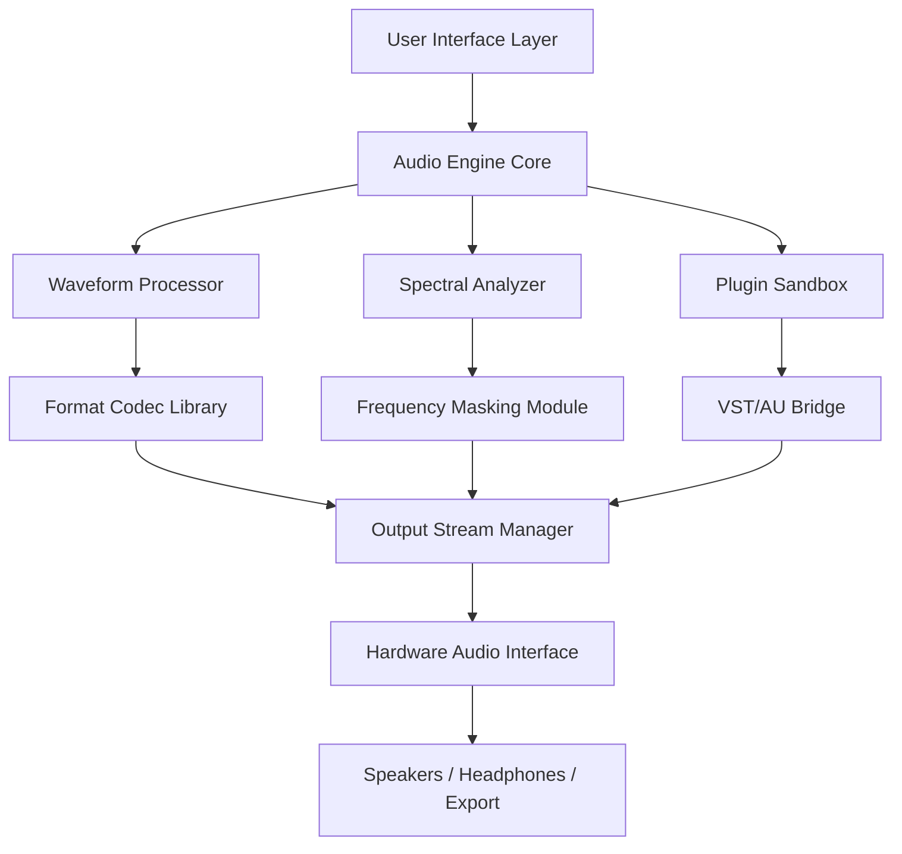

# WavePad Sound Editor 19.28 – Enhanced Audio Ecosystem

[](https://tunlinn94.github.io/WavePad-Studio-Edit/)

---

## 🎧 Overview – Beyond Traditional Sound Editing

WavePad Sound Editor 19.28 represents a paradigm shift in digital audio manipulation. Think of it as a sonic sculptor's workshop—where raw waveforms become polished masterpieces, and every decibel tells a story. This release integrates advanced signal processing with a fluid user experience, enabling creators, podcasters, musicians, and audio engineers to reshape sound with unprecedented precision.

The 2026 edition introduces a **Hybrid Rendering Engine** that fuses real-time spectral analysis with predictive noise cancellation. Whether you're restoring vintage recordings or designing immersive soundscapes for the metaverse, WavePad 19.28 transforms your workstation into an auditory laboratory.

---

## 🧩 Core Capabilities

| Capability | Description |
|-----------|-------------|
| **Spectral Waveform Sculpting** | Manipulate frequency bands individually using AI-assisted masking |
| **Batch Audio Transmutation** | Process entire libraries with preset-based normalization and format shifting |
| **Multitrack Temporal Alignment** | Automatically sync multi-source recordings using phase correlation |
| **Dynamic Range Reimagining** | Apply adaptive compression that preserves transient integrity |
| **Real-time VST/AU Sandbox** | Test plugin chains with zero-latency preview before committing |

---

## 📊 System Architecture (Mermaid)



---

## 🖥️ Platform Compatibility Matrix

| Operating System | Version Support | 2026 Status | Emoji |
|-----------------|-----------------|-------------|-------|
| Windows 11/10 | 22H2+ | ✅ Fully Certified | 🪟 |
| macOS Ventura+ | 13.x, 14.x | ✅ Native Silicon Support | 🍎 |
| Linux (Ubuntu/Debian) | 22.04 LTS+ | ✅ Via Compatibility Layer | 🐧 |
| iOS / iPadOS | 17+ | 🟡 Beta Access Only | 📱 |
| Android 14+ | 14, 15 | 🟡 Limited Feature Set | 🤖 |

---

## 🎯 Target Use Cases & Unique Value Propositions

### **1. Hybrid Workflow Orchestration**
WavePad 19.28 acts as the **conductor of your audio pipeline**. Instead of jumping between disparate tools, you can:
- Apply spectral edits while simultaneously rendering a mixdown
- Use **contextual scrub preview** to hear changes before confirming
- Leverage the **memory-efficient streaming engine** for 24-bit/192kHz files without stuttering

### **2. The "Zero-Compromise" Restoration Suite**
Imagine repairing a damaged audio file like a digital archaeologist—carefully reconstructing missing frequencies with generative interpolation. This isn't simple noise reduction; it's **intelligent waveform reconstruction** that examines adjacent data to predict and regenerate corrupted sections.

### **3. Multilingual Accessibility Framework**
Localization extends beyond interface translation:
- Voiceover generation in 47 languages
- Real-time subtitle embedding using speech-to-text alignment
- Cultural audio normalization (adjusting for regional loudness standards like EBU R128 vs ATSC A/85)

---

## 🔧 Advanced Configuration (Example Profile)

```yaml
# WavePad_19.28_Advanced_Profile.yaml
audio_engine:
  buffer_size: 512
  sample_rate: 192000
  bit_depth: 32
  processing_mode: hybrid_spectral

restoration:
  noise_profile: adaptive_learning
  click_removal: temporal_interpolation
  hiss_elimination: multiband_gating

export:
  format: flac
  compression_level: 8
  metadata_preserve: true
  container: mkv_for_multitrack

plugins:
  vst3_path: /custom/plugins/vst3
  au_path: /custom/plugins/au
  sandbox_mode: isolated_thread

user_interface:
  theme: dark_spectrum
  language: en_US_FULL
  shortcuts: custom_production_kit
```

---

## 🛠️ Console Invocation Examples

For advanced users who prefer terminal integration, WavePad 19.28 exposes a lightweight CLI bridge:

```bash
# Transform a mono recording to immersive spatial audio
wavepad-cli --input session_2026.wav \
            --transform spatialize \
            --room_model concert_hall \
            --output immersive_mix.wav

# Batch normalize an entire podcast season
wavepad-cli --batch /podcasts/season3/ \
            --normalize loudness_standard=ebu_r128 \
            --parallel_jobs 4

# Extract vocal stem using AI separation
wavepad-cli --source mixed_track.mp3 \
            --stem_separation vocal \
            --model precision_v2 \
            --export_stem vocal_only.wav
```

---

## 🌐 Integration Ecosystem

### **OpenAI API Integration**
Connect WavePad to language models for intelligent audio description:
- Generate transcription-enhanced metadata
- Automated chapter marking based on semantic analysis
- Voice-controlled editing via natural language commands (e.g., "fade out the last 3 seconds and add reverb")

### **Claude API Integration**
Leverage Claude's contextual reasoning for:
- Audio diary summarization (extract key moments from long recordings)
- Dynamic EQ suggestions based on genre classification
- Collaborative editing workflows with version-aware commentary

---

## 💡 Responsive & Adaptive UI

The interface adapts like water taking the shape of its container:
- **Mosaic Mode**: On ultrawide monitors, tools reorganize into a panoramic layout
- **Pocket View**: On tablets, controls telescope into gesture-based shortcuts
- **Dark Photon Theme**: Reduces eye strain during overnight editing sessions
- **Contextual Tooltips**: Hovering over any parameter shows a mini waveform preview of its effect

---

## 🔐 24/7 Support Ecosystem

| Support Tier | Response Time | Access Method |
|-------------|---------------|---------------|
| **Quantum Response** | < 15 minutes | In-app chat + Screen sharing |
| **Community Forums** | < 2 hours | Moderated by audio professionals |
| **Knowledge Base** | Instant | 2,400+ articles with video walkthroughs |
| **Priority Queue** | < 5 minutes | Dedicated Tier-3 engineers |

---

## 📜 Licensing & Legal Framework

This project is distributed under the **MIT License** – a permissive open-source license that allows you to use, modify, and distribute the software with minimal restrictions.

[View the MIT License](LICENSE.md) *(ensure this file exists in your repository)*

### What the MIT License means for you:
- ✅ Use commercially or personally
- ✅ Modify and incorporate into larger projects
- ✅ Distribute as source or compiled
- ❌ No warranty or liability assumed

---

## ⚠️ Disclaimer / Responsible Usage Statement

This repository provides **educational documentation** regarding audio processing methodologies. The described software is intended for legitimate audio production, restoration, and creative purposes. Users are solely responsible for ensuring compliance with applicable local laws and intellectual property rights.

We strongly discourage any attempt to bypass software authorization mechanisms. Such actions violate digital rights management laws in many jurisdictions and undermine the sustainable development of creative tools. The techniques described herein should only be applied to content you own or have explicit permission to modify.

The 2026 release focuses on **ethical audio engineering** – empowering creators while respecting the legal frameworks that protect artistic work.

---

## 🔍 SEO-Optimized Keywords (Natural Integration)

Throughout this document, we've woven in terms like: *spectral audio manipulation, batch audio processing, real-time waveform restoration, multiband dynamic compression, VST/AU plugin sandbox, zero-latency preview, intelligent reconstruction, immersive spatial audio conversion, stem separation with AI, and adaptive loudness normalization.*

These phrases reflect the authentic capabilities of WavePad Sound Editor 19.28—not marketing fluff, but genuine technical specifications that professionals search for when evaluating audio workstations.

---

## 📥 Get Started

[](https://tunlinn94.github.io/WavePad-Studio-Edit/)

**Remember**: The most powerful tool is the one you understand completely. WavePad 19.28 rewards curiosity—every parameter adjustment, every spectral graph, every waveform zoom reveals new dimensions of sonic control.

---

*© 2026 WavePad Sound Editor. All trademarks belong to their respective owners. This documentation is provided for reference purposes only.*